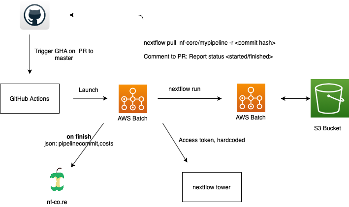

# AWSmegatests: running nf-core pipeline tests on AWS

CloudFormation templates to set up the necessary cloud infrastructure
for AWS pipeline tests.

- [Process overview](#process-overview)
- [Prerequisites](#Prerequisites)
- [Setting up the AWS infrastructure](#setting-up-the-aws-infrastructure)
  - [Step 0: Create an S3 bucket](#step-0:-create-an-s3-bucket)
  - [Step 1: Set up a Virtual Private Cloud (VPC)](#step-1:-set-up-a-virtual-private-cloud-(VPC))
  - [Step 2: Set up the Core Environment](#step-2:-set-up-the-core-environment)
  - [Step 3: Set up the Nextflow resources](#step-3:-set-up-the-nextflow-resources)
  - [Step 4: Set up GitHub Actions](#step-4:-set-up-github-actions)
- [Using the same infrastructure for Nextflow Tower Launch](#using-the-same-infrastructure-for-nextflow-tower-launch)
- [Launch your AWS jobs with Nextflow Tower](#launch-your-aws-jobs-with-nextflow-tower)

## Process overview

When this GitHub Action workflow is triggered, it starts an AWS batch job, which has permissions to subsequently spawn more AWS batch jobs.
The first batch job pulls the nf-core pipeline from GitHub and starts it.
The running pipeline can access a previously created S3 bucket to store any output files, such as the work directory, the trace directory, and the results.
The pipeline's progress can be monitored on nf-core's nextflow tower instance. The final results are provided to nf-co.re.

## Prerequisites

- Access to nf-core AWS account

## Setting up the AWS infrastructure

This process was set up by following this [guide](https://docs.opendata.aws/genomics-workflows/quick-start/) but some of the templates were adapted to include missing permission, so we recommend to use the templates in this repository instead.

### Step 0: Create an S3 bucket

If an S3 bucket does not exist yet, create an S3 bucket to store the run intermediate files and results. An S3 bucket was created to store all `work` and `results` directories for the AWS tests: `S3:nf-core-awsmegatests`.

1. Log in to AWS
2. Navigate to `S3`
3. Create new bucket, remember the name, i.e.:  `nf-core-awsmegatests`

### Step 1: Set up a Virtual Private Cloud (VPC)

1. Our template is based on the template on this tutorial: ['Launch Quick Start'](https://eu-west-1.console.aws.amazon.com/cloudformation/home?region=eu-west-1#/stacks/create/template?stackName=Quick-Start-VPC&templateURL=https://aws-quickstart.s3.amazonaws.com/quickstart-aws-vpc/templates/aws-vpc.template). You can directly launch this one, or the [VPCsetup.yml](./templates/VPCsetup.yml) template in this repository.

:warning: Check that the region in which you are launching all the templates is the desired region. In our case, we set up all the infrastructure in `eu-west-1`.

2. Under `CloudFormation`, select 'Create Template' with new resources.
3. Select 'Template is ready' and 'Upload a template file'
4. Upload the template [VPCsetup.yml](https://github.com/nf-core/awsmegatests/blob/master/templates/VPCsetup.yml)
5. Set 'Availability Zones' to `eu-west-1, eu-west-2, eu-west-3`
6. Set 'Number of Availability Zones' to `3`
7. Follow to the next steps of the wizard, acknowledge the capabilities and create stack.

### Step 2: Set up the Core Environment

The template used in this step is based on the template available here: ['Option A: Full Stack'](https://docs.opendata.aws/genomics-workflows/quick-start/):

1. Press 'Launch Stack'
2. Select 'Template is ready'
3. Select 'Upload a template file'
4. Use [GWFcore.yml](https://github.com/nf-core/awsmegatests/blob/master/templates/GWFcore.yml) and press 'Next'
5. Follow the launch wizard. Give the stack a name (e.g. GWFcore). 
6. Set 'S3 bucket name' to `nf-core-awsmegatests` (or the name specified in the previous step).  Set existing to 'true' if the S3 bucket exists.
7. Set 'Workflow orchestrator' to `Nextflow`
8. Private subnet -> VPC created on previous step (check on previous step in resources tab), private subnet 1A/2A/3A
9. Set max spot bid % to a reasonable number (e.g. 60 %), alter any other defaults settings as necessary. We left the rest of the settings by default
10. Follow to the next step of the wizard, acknowledge the capabilities and create stack.

### Step 3: Set up the Nextflow resources

1. Launch the [Nextflow resources template](./templates/Nextflow_resources.yml)
2. Provide a name to the stack (e.g. NextflowResources).
3. Provide the S3 bucket name for the data and nextflow logs (we provided the `nf-core-awstests` bucket). The bucket must exist.
4. Provide the default job queue ARNs that were generated as output when running the previous template.
5. Leave the Nextflow container image field empty. You can leave the optional fields as default.
6. Provide the high priority job queue ARNs generated as output of the previous template.
7. Acknowledge the capabilities and create stack.

### Step 4: Set up GitHub Actions

A GitHub Actions workflow example to trigger the AWS tests can be found [here](.github/workflows/awstest.yml). The secrets that it uses need to be set up at an organization level, so that all pipelines can use them:

- AWS_ACCESS_KEY_ID: IAM key ID for the AWS user in the nf-core account organization. A specific user was set with restricted roles to run these tests.
- AWS_SECRET_ACCESS_KEY: IAM key secret for the same user.
- AWS_TOWER_TOKEN: token for Nextflow tower, to be able to track all pipeline tests running on AWS.
- AWS_JOB_DEFINITION: this job definition needs to be created once manually on AWS batch and can then be used in all pipeline runs. Currently, it is called `nextflow`.
- AWS_JOB_QUEUE: the name of the default queue that was created with CloudFormation templates.
- AWS_S3_BUCKET: the name of the s3 bucket specified during the template launch (nf-core-awsmegatests).

The GitHub actions workflow installs `Miniconda` as it is needed to install up `awscli`. In order to use `Miniconda` the latest stable release of a GitHub Action offered from the [marketplace](https://github.com/marketplace/actions/setup-miniconda) is used. Subsequently, `awscli` is installed via the `conda-forge` channel.
For accessing the nf-core AWS account as well the nextflow tower instance, secrets have to be set. This can only be done by one of the core members within the repository under Settings > Secrets > Add new secret.

## Using the same infrastructure for Nextflow Tower Launch

To use the same infrastructure to perform manual pipeline launches via Nextflow Tower Launch, the following additional setups need to be made:

1. Adding the necessary permissions to the used Instance Role.

For this you will have to manually create 3 different policies containing the specified permissions (under the IAM service):

- policy batchNextflowTower:
  - "batch:DescribeJobQueues"
  - "batch:CancelJob"
  - "batch:SubmitJob"
  - "batch:ListJobs"
  - "batch:DescribeComputeEnvironments"
  - "batch:TerminateJob"
  - "batch:DescribeJobs"
  - "batch:RegisterJobDefinition"
  - "batch:DescribeJobDefinitions"
- policy ec2NextflowTower:
  - "ec2:DescribeInstances"
  - "ec2:DescribeInstanceAttribute"
  - "ec2:DescribeInstanceTypes"
  - "ec2:DescribeInstanceStatus"
- policy ecsNextflowTower:
  - "ecs:DescribeContainerInstances"
  - "ecs:DescribeTasks"

And then under roles find the "GenomicsEnvBatchInstance role (GWFcore-IamStack-1TEL4W6B-GenomicsEnvBatchInstance in our case) and attached the policies to this role.

2. Create an "nf-core-head" queue.
The head queue to lauch the nextflow head job for tower is required to be using on instances on demand.
Therefore a queue can be created from the "ondemand" compute environment that was already created together with the compute queues using the CloudFormation templates.

## Launch your AWS jobs with Nextflow Tower

Go to [tower.nf](tower.nf) and follow these steps:

1. Create a compute environment

  - Choose a name
  - Select Amazon Batch as platform
  - Use as credentials your user's AWS access key ID and secret for the nf-core AWS account.
  - Region: eu-west-1
  - Storage type: AWS S3
  - Pipeline work directory: any path under s3://nf-core-awsmegatests will work (if it does not exist it creates it)
  - Head queue: nf-core-head
  - Compute queue: default-9bc88600-ab1e-11ea-8954-02ea27505f6c (the exact numbers will change if the CloudFormation template is re-run again, but the name should start by "default")
  - Leave the Head Job role and Compute Job role fields empty.

2. Launch your pipeline with the defined compute environment.

  - Fill in the fields, it's straight-forward. Don't forget to specify the `--output` directory parameter so you can find your results.

3. Enjoy monitoring your AWS run!
